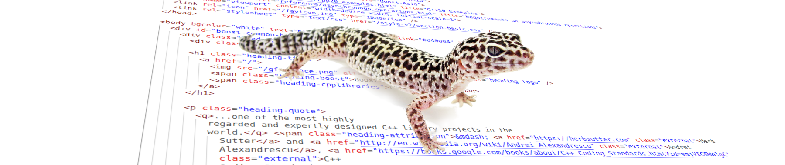

# Boost-Gecko

A crawler with the goal of creating a search index by crawling HTML documents for every library in the Boost release archive.

## How it works

It extracts contents with the correct hierarchy for each library and generates records like this:

```JSON
{
    "type": "content",
    "library_key": "url",
    "library_name": "URL",
    "content": "this->has_fragment() == false && this->encoded_fragment() == \"\"",
    "weight": {
        "pageRank": 0,
        "level": 60,
        "position": 0
    },
    "hierarchy": {
        "lvl0": {
            "title": "Reference",
            "path": "libs/url/doc/html/url/ref.html"
        },
        "lvl1": {
            "title": "url",
            "path": "libs/url/doc/html/url/ref/boost__urls__url.html"
        },
        "lvl2": {
            "title": "url::remove_fragment",
            "path": "libs/url/doc/html/url/ref/boost__urls__url/remove_fragment.html"
        },
        "lvl3": {
            "title": "Postconditions",
            "path": "libs/url/doc/html/url/ref/boost__urls__url/remove_fragment.html#url.ref.boost__urls__url.remove_fragment.postconditions"
        },
        "lvl4": null,
        "lvl5": null,
        "lvl6": null
    }
}
```

## How to use

### Configuration

[config.yaml](./config/config.yaml) contains all the information that Boost-Gecko requires to extract search records and upload them to Algolia.

**Tip:** You can use `config.local.yaml` for development purposes (e.g., working on a single crawler); this file has higher priority over `config.yaml` and is listed in `.gitignore`.

### Downloading and extracting Boost release archive

Assuming we are in boost-gecko directory, we download and extract Boost release archive in `../boost_1_85_0`.

```BASH
wget https://boostorg.jfrog.io/artifactory/main/release/1.85.0/source/boost_1_85_0.tar.gz
tar -xzf boost_1_85_0.tar.gz -C ../
```

### Extracting search records

The following command utilizes the crawler and library list specified in the config to extract search records and store them in the [algolia_records](./algolia_records) directory.

```BASH
python -m gecko.extract_records # Utilizes all available cores
# or
python -m gecko.extract_records --concurrency=4 # Utilizes 4 cores
```

### Validating the generated records

The purpose of this step is to identify unexpected issues between releases. For example, a library may have changed its documentation method, causing the configured crawler to fail in extracting search records.

The following command validates whether the numbers of records, words, and lvls generated from the previous step are within 5% of the expected numbers in the configuration or not.

**Note:** It is quite common to encounter false positive errors in this step due to significant changes in library documentation. The objective is to ensure that changes are valid, update the expected numbers in the configuration, and rerun the process.

```BASH
python -m gecko.sanitizer check
```

### Updating configuration with the generated records

The following command updates [config.yaml](./config/config.yaml) with the latest numbers of records, words, and lvls for each library. These numbers will be utilized for the validation step in the next release.

```BASH
python -m gecko.sanitizer update-config
```

### Uploading Algolia records

The following command uploads records from the [algolia_records](./algolia_records) directory. It uses the `boost.version` from the config file for the index name.

**Note:** `algolia.settings` from the config file would be used for the index settings on Aloglia; no need to adjust index settings via dashboard.

```BASH
python -m gecko.index_on_algolia
```

## Acknowledgments

- [Tomasz Kalisiak](https://github.com/Bobini1) for adding a crawler for Boost.Hana library.

